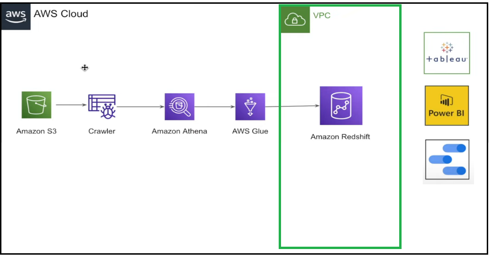

# Basic of Data Engineering with AWS

## Introduction

The project "Basic of Data Engineering with AWS" involves using AWS services to build a data pipeline that analyzes COVID-19 data from the AWS Open Datasets. The main script, DE-Project.py, uses S3, Glue, and Redshift to extract, transform, and load data into a Redshift data warehouse. The DE-Project-test-redshift.py file is used to verify the data loaded in Redshift by querying the database and comparing results to expected output. The project demonstrates how to use AWS services for data warehousing tasks.

## Architecture 

## Technology Used

- Programming Language - Python
- Amazon Web Service (AWS)
1. S3 (Simple Storage Service)
2. Athena
3. Glue
3. RedShift

## Dataset Used

Here is the dataset used in the project - https://github.com/Math-Muniz/Basic-of-Data-Engineering-with-AWS/blob/main/drive-download-20230107T153453Z-001.zip

## Table Architecture

Here you can access the table's architecture - https://github.com/Math-Muniz/Basic-of-Data-Engineering-with-AWS/blob/main/Cloud-series-DE-Project.drawio

##Other Links

1. https://aws.amazon.com/pt/blogs/big-data/exploring-the-public-aws-covid-19-data-lake/
2. https://aws.amazon.com/pt/blogs/big-data/a-public-data-lake-for-analysis-of-covid-19-data/
3. https://dj2taa9i652rf.cloudfront.net/
4. https://aws.amazon.com/pt/covid-19-data-lake/
